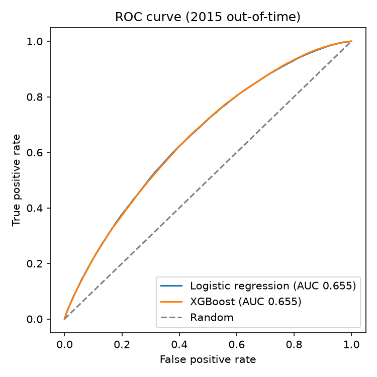
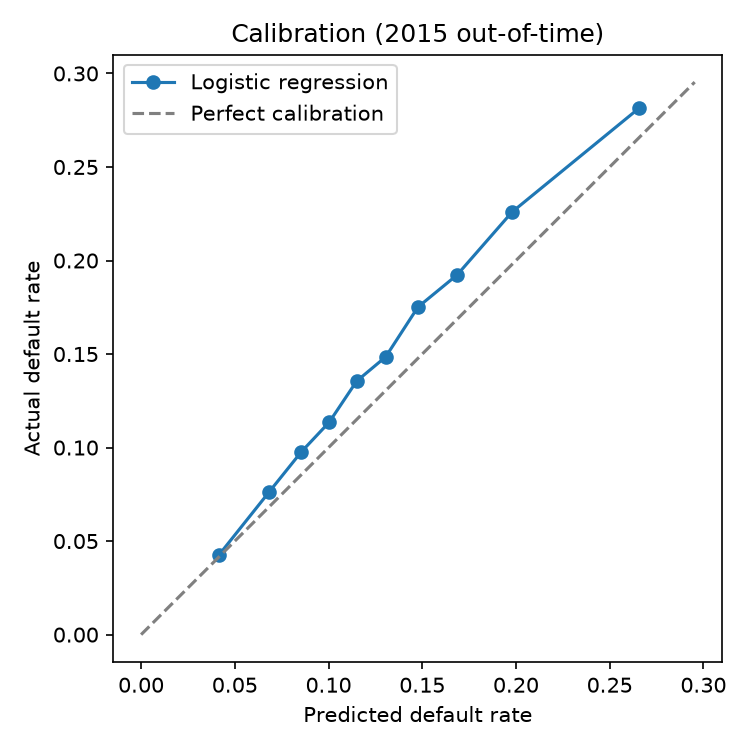
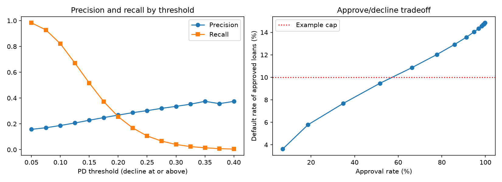
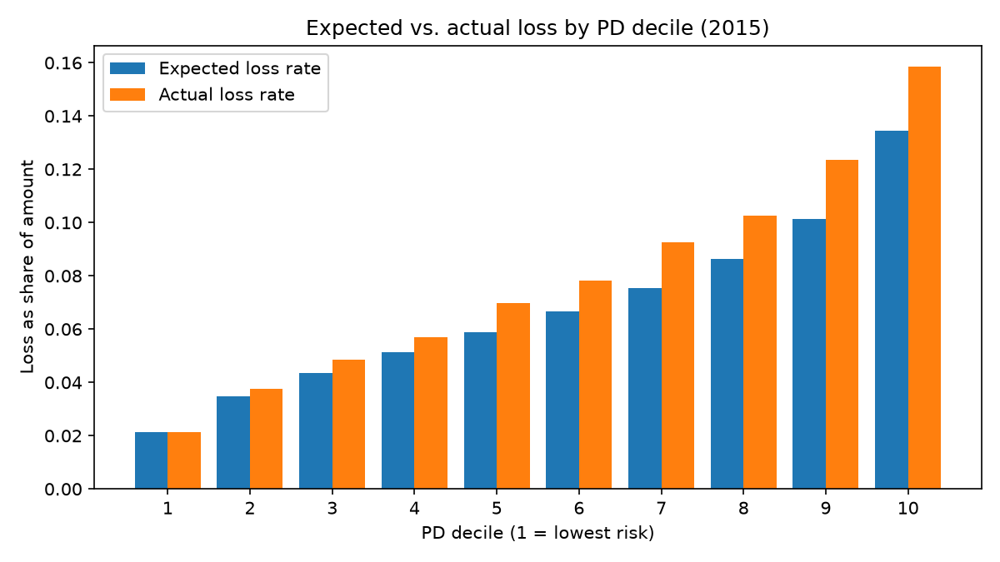
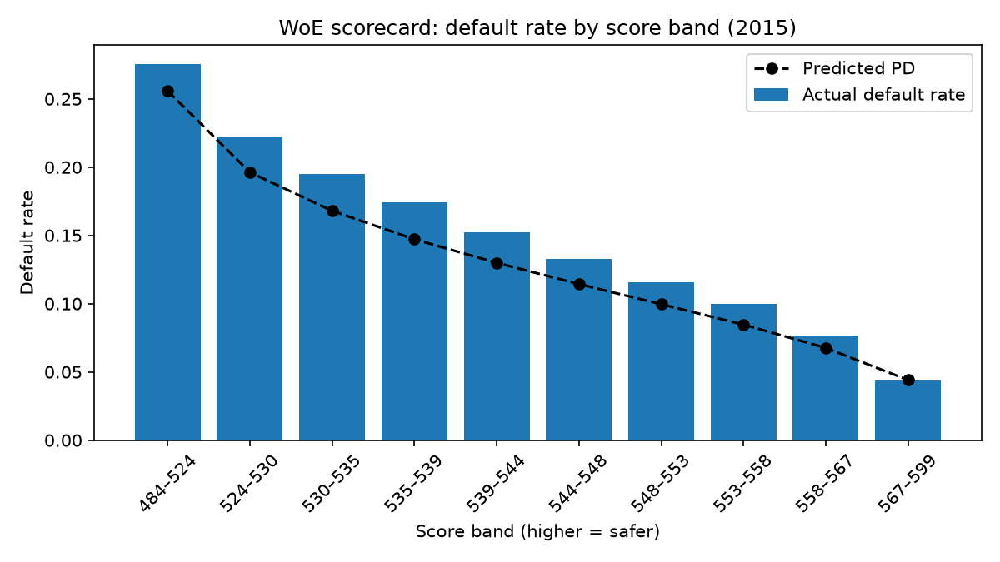
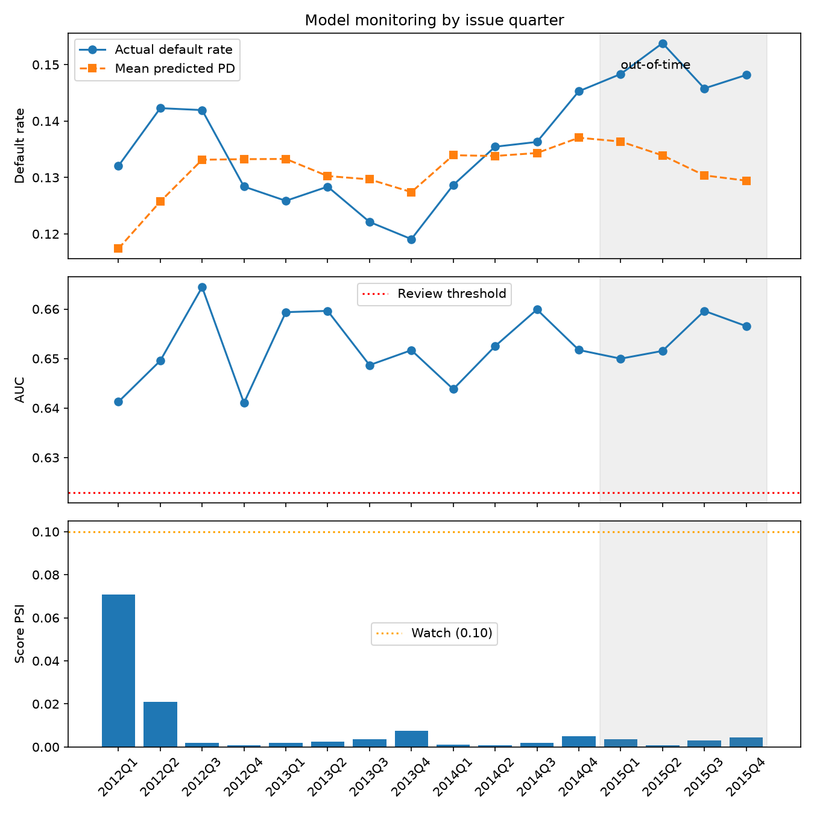
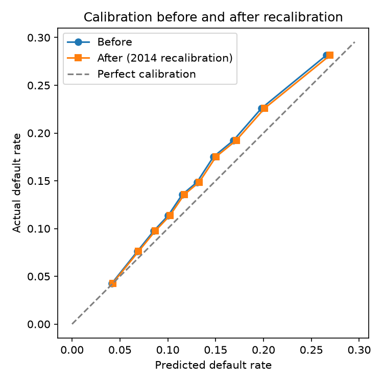
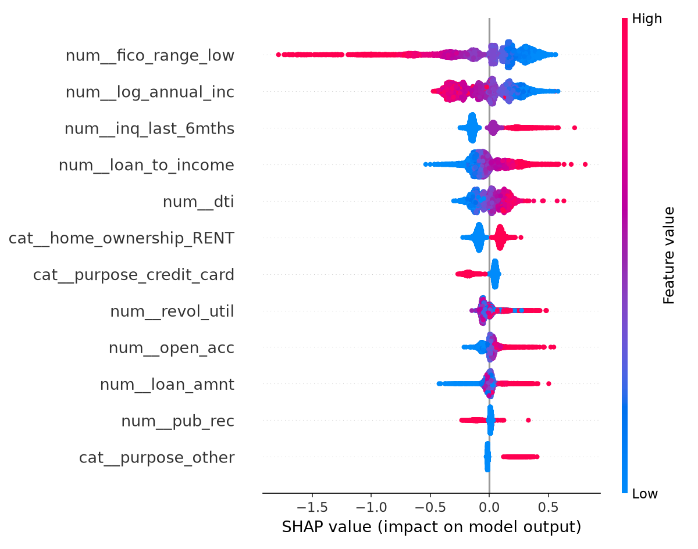
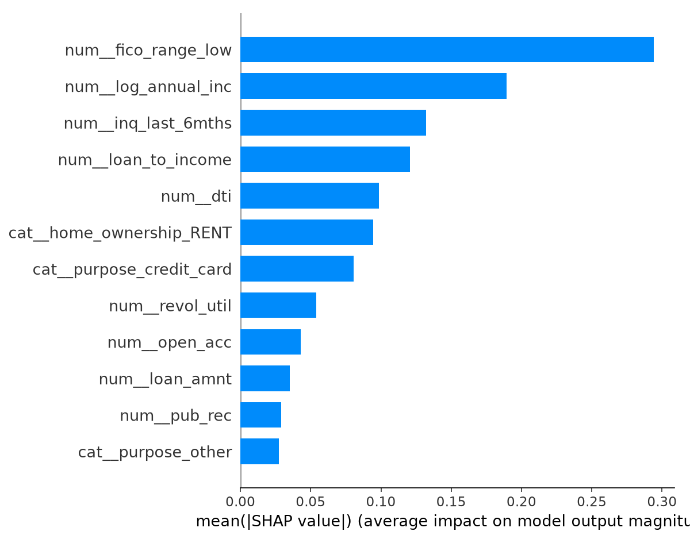
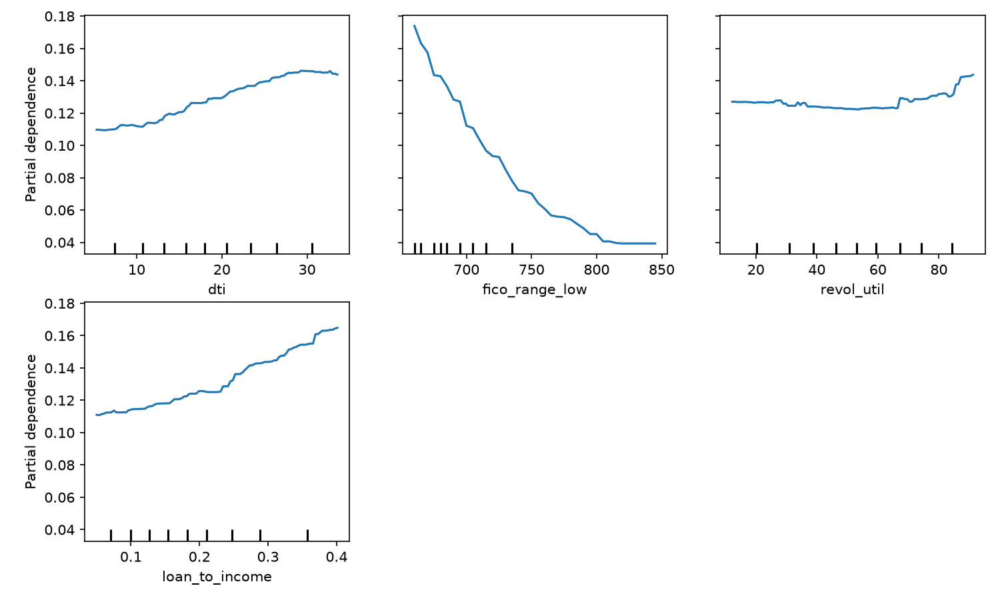

# Credit Default Prediction Model

[](https://github.com/3JSaunders1/credit-default-model/actions/workflows/tests.yml)

An end-to-end credit risk model built on Lending Club loan data, developed and evaluated the way a bank would evaluate a credit model before relying on it: probability of default (PD) with out-of-time validation, discrimination and calibration metrics, an expected loss framework (PD × LGD × EAD) validated against realized losses, time-aware hyperparameter tuning, a Weight of Evidence scorecard, quarterly population stability and performance monitoring, recalibration, macroeconomic features from the FRED API, explainability, a PySpark implementation reconciled against SQL, threshold analysis for approve/decline decisions, automated tests, a Docker image, and an honest account of limitations.

---

## Key Findings at a Glance

| | Result |
|---|---|
| **Out-of-time AUC (2015 vintage)** | 0.655 for logistic regression (Gini 0.31, KS 0.22); 0.660 for XGBoost (Gini 0.32, KS 0.23) |
| **Risk separation** | Actual default rates rise from **4.3%** in the lowest-risk decile to **28.1%** in the highest, about **6.6x** |
| **Logistic regression vs. XGBoost** | On identical training data, XGBoost adds a small edge (+0.005 AUC). Monotonic XGBoost keeps nearly all of it (0.659) with economically sensible constraints |
| **Expected loss** | Predicted 2015 losses of $234.5M vs. $274.0M actual (−14%). Decomposition shows almost the entire shortfall came from PD; LGD (88.9%) and EAD (57.5%) held within about 1% of their assumptions |
| **Approval policy** | Keeping approved loans' default rate under 10% means declining applicants with PD of 12.5% or more: approving 52% of applicants while catching 67% of defaulters |
| **Hyperparameter tuning** | 21 configurations under time-aware cross-validation all scored within 0.003 AUC. An apparent tuning gain turned out to come entirely from training on more recent data |
| **WoE scorecard** | A classic points-based scorecard nearly matches the benchmark logistic regression (AUC 0.651 vs. 0.655) using half the features, with every coefficient correctly signed |
| **Calibration** | The base model **underpredicts** 2015 defaults: 13.2% predicted vs. 14.9% actual |
| **Population stability** | Score PSI of **0.001**: no meaningful shift in the borrower population |
| **Main insight** | The 2015 miss is **concept drift, not data drift**. Borrowers looked the same, but defaulted more. PSI alone would not have caught it. |
| **Monitoring** | Quarterly monitoring shows every input stable (all feature PSIs green) and AUC steady, but calibration flagged in every 2015 quarter, with the gap already rising in late 2014 |
| **Recalibration** | Two designs tested, including a strict 2014 holdout. Both moved the 2015 mean PD to only about 13.4% (vs. 14.9% actual), confirming the remaining gap is genuine concept drift |
| **Macro features** | Cut the calibration gap roughly in half (14.1% vs. 14.9% actual), but national unemployment showed a counterintuitive, cycle-driven sign that should not be trusted in production |
| **Explainability** | Drivers match credit intuition (loan purpose, FICO, renting, inquiries, loan-to-income, DTI), with SHAP reason codes for individual loans |
| **Scaling** | The data pipeline is also implemented in **PySpark**, reconciled against the DuckDB SQL version across 1,020,743 loans with **zero discrepancies** |
| **Engineering** | 46 automated tests run on every push, a Docker image for one-command reproducibility, shared preprocessing and model settings across scripts, pinned dependencies, a one-command pipeline, and timestamped run archives |

---

## 1. Purpose

The goal is to predict the probability that a 36-month consumer loan is **charged off at any point over its term**, using only information available **at origination**, to translate that into **expected losses**, and to evaluate both with the rigor expected in bank model risk management.

The project emphasizes:

- **Avoiding leakage**: only features known when the loan was issued.
- **Out-of-time validation**: training on earlier vintages and testing on a later one, which mirrors how a credit model is actually used.
- **Calibration, not just ranking**: PDs feed expected loss (PD × LGD × EAD), reserves, pricing, and capital, so the probability levels need to be right, not just the ordering.
- **Monitoring**: tracking inputs, ranking, and calibration over time to understand whether performance changes come from data drift or concept drift.
- **Explainability**: making model behavior transparent and defensible, as lenders must be able to explain credit decisions.
- **Questioning results**: testing whether an improvement is trustworthy, not just whether a metric went up.
- **Reproducibility**: tests, pinned dependencies, a Docker image, and archived runs, so every result can be traced and rerun.

This complements my [Macro-Driven Credit Risk Lab](https://github.com/3JSaunders1/macro-credit-risk-lab), which models how macroeconomic conditions drive credit risk. This project focuses on borrower-level default prediction and loss estimation.

---

## 2. Data

### Loan data
- **Lending Club accepted loans, 2007–2018 Q4**, from the public Kaggle dataset `wordsforthewise/lending-club`.
- Downloaded programmatically through the Kaggle API (`src/credit_default/download.py`). Only the accepted-loans file is downloaded, and it is read directly in compressed form to save disk space.

### Macroeconomic data
- **FRED API** (Federal Reserve Bank of St. Louis): national unemployment rate, federal funds rate, and state unemployment rates for all 50 states plus DC (`src/credit_default/fred.py`).

### Target definition
- **`default_flag = 1`** if the loan status is *Charged Off*.
- **`default_flag = 0`** if the loan status is *Fully Paid*.
- This is a **lifetime default** target over the 36-month term, not a 12-month PD.

### Sample filters and why
| Filter | Reason |
|---|---|
| Only *Fully Paid* or *Charged Off* loans | Every loan has a known final outcome. Loans still being repaid have no outcome yet. |
| Only 36-month loans | Keeps the default window consistent across loans. |
| Only loans issued **2012–2015** | See the censoring issue below. Earlier years have few loans and reflect a different stage of Lending Club's business. |

### The censoring trap
Default rates by issue year, among completed 36-month loans:

| Year | Loans | Default rate |
|---|---|---|
| 2012 | 43,470 | 13.6% |
| 2013 | 100,422 | 12.3% |
| 2014 | 162,570 | 13.7% |
| 2015 | 283,026 | 14.9% |
| 2016 | 232,353 | 19.8% |
| 2017 | 128,538 | 20.0% |
| 2018 | 41,268 | 13.2% |

The jump in 2016–2017 is largely an artifact. The data ends in late 2018, so 36-month loans issued in 2016 or later had **not finished** by then. Among those vintages, the loans with a final outcome are disproportionately **early defaults**, which inflates the default rate. To avoid this censoring bias, the sample is restricted to vintages whose 36-month loans had **fully matured** by the end of 2018, meaning loans issued by December 2015.

### Out-of-time split
| Set | Vintages | Loans | Default rate |
|---|---|---|---|
| **Train** | 2012–2014 | 306,462 | 13.2% |
| **Test (out-of-time)** | 2015 | 283,026 | 14.9% |

---

## 3. Approach

### Pipeline
```
Kaggle API → DuckDB (SQL) → features → models → evaluation → recalibration → monitoring
           → PySpark      → parity check against DuckDB      → tuning, WoE scorecard
           → loss outcomes (SQL) → expected loss (PD × LGD × EAD)   → threshold analysis
FRED API   → DuckDB (SQL join) → macro comparison
                                 → explainability
```

1. **Download** (`download.py`): pulls only the accepted-loans file through the Kaggle API.
2. **Load and filter with SQL** (`sql/01_build_loan_table.sql`, `data.py`): DuckDB reads the compressed CSV, builds the target, applies the sample filters, and selects origination-time features.
3. **Feature engineering** (`features.py`): cleaning, engineered features, imputation, and the out-of-time split.
4. **Training** (`train.py`): shared preprocessing and model settings, a logistic regression benchmark, and an XGBoost challenger.
5. **Evaluation** (`evaluate.py`): AUC, Gini, KS, calibration, ROC, and PSI.
6. **Recalibration** (`recalibrate.py`): intercept adjustment, comparing the original design with a strict design that holds out the 2014 vintage.
7. **Macro data** (`fred.py`, `sql/02_add_macro.sql`): pulls FRED series and joins them to loans in SQL.
8. **Macro comparison** (`compare_macro.py`): base vs. macro-enhanced logistic regression.
9. **Explainability** (`explain.py`): odds ratios, SHAP values, partial dependence, and monotonic constraints.
10. **Spark pipeline and parity check** (`spark_pipeline.py`, `compare_engines.py`): rebuilds the loan table in PySpark and reconciles it against the DuckDB version.
11. **Monitoring report** (`monitor.py`): feature-level PSI, score PSI, AUC, and calibration by issue quarter, with traffic-light thresholds.
12. **WoE scorecard** (`woe.py`): Weight of Evidence binning, information value selection, a logistic regression on WoE values, and a points-based scorecard.
13. **Hyperparameter tuning** (`tune.py`): random search for XGBoost and a regularization grid for logistic regression, under expanding-window time-aware cross-validation.
14. **Expected loss** (`expected_loss.py`, `sql/03_loss_outcomes.sql`): LGD and EAD estimated from 2012–2014 charge-offs, combined with PD, and validated against realized 2015 losses.
15. **Threshold analysis** (`thresholds.py`): confusion matrices, precision, recall, approval rates, and approved-loan default rates across PD cutoffs, with an example approval policy.

### Features
**Used (all known at origination):**
- Loan amount, debt-to-income (capped at the 99th percentile), FICO score (lower bound of range), revolving utilization, delinquencies in the past 2 years, inquiries in the past 6 months, open accounts, public records
- **Engineered:** log annual income, employment length in years, loan-to-income ratio
- **Missing indicators** for employment length, DTI, and revolving utilization, since missingness can itself carry risk information
- **Categorical:** home ownership and loan purpose, one-hot encoded with a dropped reference category (**mortgage holders** and **car loans**). Rare categories (under 1%) are grouped, and categories unseen in training are mapped to that infrequent group.
- **Macro (comparison model only):** national unemployment, federal funds rate, state unemployment, and 12-month change in state unemployment

**Deliberately excluded:**
- **Post-origination fields** such as total payments, recoveries, and last payment date. These are only known after the loan plays out and would cause **data leakage**.
- **Lending Club's grade and interest rate.** These are outputs of Lending Club's own risk model. Including them would raise AUC but make this model largely replicate Lending Club's pricing. Excluding them keeps the model **independent**.

### Leakage controls
- Only origination-time features, enforced by automated tests.
- Imputation medians, WoE bins, and WoE values are computed on the **training data only** and then applied to the test set.
- Preprocessing (scaling, encoding) is wrapped in a scikit-learn `Pipeline` / `ColumnTransformer`, so the same fitted transformations are applied consistently.
- Hyperparameter tuning uses only folds within 2012–2014; the 2015 test set is evaluated once, after settings are chosen.
- Recalibration uses only data that would be available at prediction time (the 2014 vintage), never the 2015 test outcomes.
- **Loss outcomes** (principal repaid, recoveries, and collection fees) are read through a **separate SQL file** and used only to measure LGD and EAD, never as PD model features. LGD and EAD assumptions come from 2012–2014 charge-offs only.
- Macro values use the **month before origination**, since monthly economic data is published with a lag.

### Models
**Logistic regression (benchmark)**
- Standardized numeric features and one-hot encoded categories, trained on all of 2012–2014.
- **No class weights.** With a 13% default rate, the imbalance is moderate, and class weighting would distort the predicted probabilities. Because this is a PD model, calibrated probabilities take priority.

**XGBoost (challenger)**
- Shallow trees (`max_depth=4`), learning rate 0.05, row and column subsampling of 0.8.
- **Two-step, time-aware training**: early stopping (trained on 2012–2013, validated on 2014) chooses the number of trees (**208**); the model is then **refit on all of 2012–2014** with that tree count, so it trains on exactly the same data as the logistic regression.

**Monotonic XGBoost (constrained challenger)**
- The same settings and two-step training, with monotonic constraints so key risk drivers can only move predicted risk in the economically sensible direction.

**WoE scorecard (traditional challenger)**
- Features binned into up to ten quantile bins (or categories), converted to Weight of Evidence, filtered by information value, and fit with logistic regression, then scaled to points.

---

## 4. Results

All results are on the **2015 out-of-time test set** (283,026 loans).

### Discrimination
| Model | AUC | Gini | KS | Mean predicted PD | Actual default rate |
|---|---|---|---|---|---|
| Logistic regression | 0.655 | 0.310 | 0.223 | 13.2% | 14.9% |
| XGBoost | 0.660 | 0.320 | 0.232 | 13.3% | 14.9% |
| Monotonic XGBoost | 0.659 | — | — | — | 14.9% |
| WoE scorecard | 0.651 | 0.302 | 0.218 | 13.1% | 14.9% |



**Interpretation:**
- All models separate risk meaningfully, though modestly, which is expected for a model built only on application data without Lending Club's grade.
- **On identical training data, XGBoost adds a small edge** of about 0.005 AUC over logistic regression, suggesting limited nonlinear structure in these features.
- **Monotonic XGBoost keeps nearly all of that gain** (0.659), while guaranteeing that risk moves in economically sensible directions. That makes it the strongest defensible challenger.
- **The choice is a classic tradeoff.** For a regulated PD model, the logistic regression's transparency and ease of validation may outweigh a 0.005 AUC gain; where a small accuracy improvement matters, the monotonic XGBoost offers a defensible alternative.

### Calibration (logistic regression, by risk decile)
| Decile | Loans | Predicted | Actual |
|---|---|---|---|
| 0 (lowest risk) | 28,303 | 4.17% | 4.28% |
| 1 | 28,303 | 6.81% | 7.60% |
| 2 | 28,302 | 8.54% | 9.76% |
| 3 | 28,303 | 10.04% | 11.36% |
| 4 | 28,302 | 11.50% | 13.55% |
| 5 | 28,303 | 13.05% | 14.85% |
| 6 | 28,302 | 14.77% | 17.51% |
| 7 | 28,303 | 16.86% | 19.23% |
| 8 | 28,302 | 19.79% | 22.59% |
| 9 (highest risk) | 28,303 | 26.55% | 28.13% |



**Interpretation:**
- **Ranking holds up:** actual default rates rise monotonically across deciles, from 4.3% to 28.1%.
- **Levels are too low:** the model underpredicts default in nearly every decile, by roughly 1 to 3 percentage points. Overall, it predicts 13.2% against an actual 14.9%. Its predictions are anchored to the training period's lower default rate.

### Population stability
| Comparison | Score PSI |
|---|---|
| Train (2012–2014) vs. test (2015) | **0.001** |

A PSI below 0.10 is conventionally considered stable. At 0.001, the score distribution is essentially unchanged.

### Threshold analysis: from PD to an approval policy
A PD model ultimately feeds a decision: approve or decline. `thresholds.py` evaluates the logistic regression's 2015 PDs across cutoffs, treating a PD at or above the threshold as a decline:

| Decline if PD ≥ | Precision | Recall | Approval rate | Default rate of approved loans |
|---|---|---|---|---|
| 7.5% | 17.0% | 92.8% | 18.6% | 5.8% |
| 10.0% | 18.7% | 82.1% | 34.7% | 7.7% |
| **12.5%** | **20.7%** | **67.2%** | **51.6%** | **9.5%** |
| 15.0% | 22.8% | 51.7% | 66.3% | 10.9% |
| 20.0% | 26.8% | 25.6% | 85.8% | 12.9% |
| 30.0% | 33.5% | 4.0% | 98.2% | 14.5% |

The full table, including confusion-matrix counts and F1, is in `reports/figures/threshold_analysis.csv`.



**Interpretation:**
- **Precision is low at every cutoff** (about 16% to 37%), as expected with a 15% default rate and an AUC of 0.655: most loans flagged as risky still repay.
- **The tradeoff is steep.** An example policy that keeps approved loans' default rate at or below 10% declines PDs of 12.5% or more, approving only **52%** of applicants while catching **67%** of defaulters, compared with a 14.9% default rate if every applicant were approved.
- **This is the practical cost of modest discrimination,** and it shows why lenders rely on richer data, such as bureau tradelines and their own risk grades, which this model deliberately excludes.
- **Concept drift affects cutoffs too.** Because the model underpredicts 2015 PDs, a cutoff chosen on these probabilities would be too lenient in practice; thresholds should be set on recalibrated PDs and monitored over time.

### Expected loss (PD × LGD × EAD)
The PD model was extended to dollar losses (`expected_loss.py`):

- **EAD (exposure at default):** the share of the original loan amount still owed at charge-off.
- **LGD (loss given default):** the share of that exposure never recovered, after net recoveries (recoveries minus collection fees).
- **Expected loss** for each loan = PD × LGD × (loan amount × EAD ratio).

LGD and the EAD ratio were estimated as averages over **40,596 charged-off loans from 2012–2014**, then applied to the 2015 portfolio, so no 2015 information enters the estimates.

**Portfolio results (2015: 283,026 loans, $3.62 billion originated):**

| Estimate | Expected loss | Loss rate | vs. actual |
|---|---|---|---|
| Base PD | $234.5M | 6.47% | −14.4% |
| Recalibrated PD | $238.6M | 6.58% | −12.9% |
| **Actual realized loss** | **$274.0M** | **7.56%** | — |

**Which component drove the shortfall:**

| Component | Assumed (2012–2014) | Actual (2015) | Actual ÷ assumed |
|---|---|---|---|
| PD (default rate) | 13.2% | 14.9% | **1.127** |
| LGD | 88.9% | 89.2% | 1.004 |
| EAD ratio | 57.5% | 58.3% | 1.013 |

**Expected vs. actual loss rate by PD decile (share of originated amount):**

| Decile | Expected | Actual |
|---|---|---|
| 1 (lowest risk) | 2.12% | 2.13% |
| 2 | 3.48% | 3.75% |
| 3 | 4.37% | 4.86% |
| 4 | 5.13% | 5.70% |
| 5 | 5.88% | 6.99% |
| 6 | 6.67% | 7.82% |
| 7 | 7.56% | 9.27% |
| 8 | 8.62% | 10.25% |
| 9 | 10.12% | 12.34% |
| 10 (highest risk) | 13.46% | 15.86% |



**Interpretation:**
- **Severity estimates are realistic and stable.** LGD of 88.9% is typical for unsecured consumer loans with no collateral, and an EAD ratio of 57.5% means defaulting borrowers had repaid about 42% of principal on average before charge-off.
- **Expected losses fell short by about 14%** ($39.5 million on a $3.62 billion portfolio). Recalibration narrowed this only slightly, to about 13%.
- **Almost the entire shortfall came from PD.** Actual defaults ran 12.7% above prediction, while LGD and EAD held within about 1% of their assumptions; together, 1.127 × 1.004 × 1.013 ≈ 1.14 reproduces the 14% gap. **Severity held steady; default frequency drifted**, the concept drift finding measured in dollars.
- **Ranking holds in dollar terms**, with loss rates rising from 2.1% to 15.9% across deciles. The safest decile is predicted almost exactly, while riskier deciles are underpredicted by roughly 15–20%.
- **For reserving, this points to a targeted response.** A CECL-style reserve built on this model would have been about $40 million short. Because LGD and EAD were accurate, a qualitative adjustment or overlay should focus on **default frequency**, particularly in higher-risk segments.

### Hyperparameter tuning
Settings were tuned with **expanding-window, time-aware cross-validation** (`tune.py`), so every fold trains on earlier loans and validates on later ones:

| Fold | Train on | Validate on |
|---|---|---|
| 1 | 2012 – mid-2013 | 2013 H2 |
| 2 | 2012 – 2013 | 2014 H1 |
| 3 | 2012 – mid-2014 | 2014 H2 |

**XGBoost:** a random search over 20 configurations (tree depth, learning rate, minimum child weight, subsampling, and L2 regularization), plus the original settings.

| Rank | Depth | Learning rate | Min child weight | Subsample | Column sample | L2 | CV AUC |
|---|---|---|---|---|---|---|---|
| 1 | 4 | 0.02 | 50 | 0.6 | 1.0 | 5.0 | 0.6544 ± 0.0018 |
| 2 | 4 | 0.02 | 50 | 0.8 | 0.6 | 0.5 | 0.6543 ± 0.0019 |
| 3 | 2 | 0.10 | 50 | 0.8 | 0.8 | 10.0 | 0.6542 ± 0.0017 |
| 4 | 6 | 0.05 | 50 | 0.8 | 0.6 | 10.0 | 0.6538 ± 0.0021 |
| **5 (original)** | **4** | **0.05** | **1** | **0.8** | **0.8** | **1.0** | **0.6538 ± 0.0022** |

**Logistic regression:** cross-validated AUC was between 0.648 and 0.650 for every regularization strength from C = 0.001 to 10.

**Interpretation:**
- **Hyperparameters barely matter.** All 21 XGBoost configurations scored between 0.652 and 0.654, with differences within fold-to-fold noise; the original settings ranked fifth, 0.0006 below the best. Regularization made no meaningful difference to the logistic regression, as expected with 300,000 loans and about 25 inputs.
- **An apparent tuning gain was tested and explained.** The tuned XGBoost scored 0.661 on 2015, far above what cross-validation suggested. Refitting the **original** settings on the same data scored **0.661 as well**, showing the gain came entirely from **training on all of 2012–2014, including the most recent vintage**, rather than from the tuned settings.
- **That finding changed the production training design.** XGBoost originally trained on 2012–2013 only, with 2014 reserved for early stopping. It now uses early stopping to choose the tree count, then refits on all of 2012–2014, matching the logistic regression's training data and making the model comparison fair.
- **The model is limited by the information in the data, not its settings.**

Early stopping uses each fold's validation set to choose the tree count, which makes fold AUCs slightly optimistic; this affects every configuration equally, so the ranking remains fair, and the 2015 test set was not used for any selection.

### Weight of Evidence scorecard
A traditional retail credit scorecard (`woe.py`) was built as a transparent challenger. Each feature is split into up to ten quantile bins (or its categories, with those under 1% grouped), and each bin is replaced by its **Weight of Evidence**: `ln(share of good loans in the bin ÷ share of bad loans in the bin)`, so positive values indicate lower risk. Bins and WoE values are fit on training data only.

**Information value (IV)** measures each feature's overall predictive power. Features below 0.02 were dropped:

| Feature | IV | Strength |
|---|---|---|
| FICO score | 0.132 | Medium |
| Log annual income | 0.087 | Weak |
| Debt-to-income | 0.048 | Weak |
| Loan-to-income | 0.043 | Weak |
| Home ownership | 0.039 | Weak |
| Inquiries in the past 6 months | 0.029 | Weak |
| Loan purpose | 0.022 | Weak |
| Revolving utilization | 0.021 | Weak |

Eight of sixteen features were kept. Employment length, loan amount, delinquencies, public records, open accounts, and the missing-value indicators fell below the threshold (full table: `reports/figures/woe_information_value.csv`).

The scorecard uses the industry-standard scaling: **600 points corresponds to 50-to-1 odds against default, and every 20 points doubles the odds.** The points for every bin are in `reports/figures/woe_scorecard_points.csv`.

| Score band (2015) | Loans | Actual default rate | Predicted PD |
|---|---|---|---|
| 484–524 (riskiest) | 28,303 | 27.5% | 25.6% |
| 524–531 | 28,303 | 22.2% | 19.6% |
| 531–536 | 28,302 | 19.5% | 16.8% |
| 536–540 | 28,303 | 17.4% | 14.7% |
| 540–544 | 28,302 | 15.2% | 13.0% |
| 544–548 | 28,303 | 13.3% | 11.4% |
| 548–553 | 28,302 | 11.6% | 10.0% |
| 553–559 | 28,304 | 10.0% | 8.5% |
| 559–568 | 28,301 | 7.7% | 6.8% |
| 568–600 (safest) | 28,303 | 4.4% | 4.4% |



**Interpretation:**
- **The scorecard nearly matches the benchmark logistic regression** (AUC 0.651 vs. 0.655) using **half the features**, with every bin's contribution visible in a points table. That is the classic scorecard tradeoff: a small loss in accuracy for full transparency.
- **Every coefficient has the expected negative sign**, so each feature moves risk in the economically sensible direction.
- **Default rates fall steadily with score**, from 27.5% in the riskiest band to 4.4% in the safest.
- **The same underprediction appears in every band but the top one**, the concept drift found throughout this project.
- **Most features are individually weak.** Only FICO reaches medium strength, which explains why overall discrimination is modest: no single application variable carries much signal.
- **Loan purpose has low IV despite a large small-business effect.** Small business loans carry about 2.4 times the odds of default of car loans (Section 8), but they are a small share of loans, so they add little predictive power across the whole population. IV measures population-wide signal, not the size of an effect within a small group.
- **The score range is narrow** (484 to 600, median 544), reflecting the modest spread of risk available from application data alone.

---

## 5. Key Finding: Concept Drift, Not Data Drift

The evaluation produces two results that look contradictory at first:

1. The **population did not change**. The score PSI is 0.001, so 2015 borrowers look almost identical to 2012–2014 borrowers on the features the model uses.
2. **Outcomes did change**. The default rate rose from 13.2% to 14.9%, and the model underpredicted risk across the board.

Together, these point to **concept drift**: the *relationship* between borrower characteristics and default shifted, rather than the *mix* of borrowers. Borrowers with the same profile were simply more likely to default in the 2015 vintage, plausibly reflecting vintage-level effects such as underwriting changes, competitive conditions in the lending market, or the credit cycle. The macro analysis in Section 7 supports the credit-cycle explanation, and the expected loss decomposition in Section 4 shows the drift was in **default frequency**, not loss severity.

**Why this matters for model monitoring:** a monitoring program that relied only on PSI or other input-stability checks would have reported the model as stable. The deterioration is only visible through **calibration and performance monitoring** against realized outcomes. Effective credit model monitoring needs both:

| Monitoring type | What it detects | What it found here |
|---|---|---|
| Population stability (PSI) | Data drift: changes in inputs | Nothing (PSI = 0.001) |
| Calibration and performance | Concept drift: changes in relationships | Systematic underprediction |

### Quarterly monitoring report

A monitoring report (`monitor.py`) applies the review triggers from the model card to every issue quarter from 2012 to 2015: feature-level PSI for every input, score PSI, AUC, and calibration. Thresholds: PSI above 0.10 is a watch and above 0.25 requires action; an AUC drop of more than 0.03 or a calibration gap above 1 percentage point triggers review. Continuous features use decile-binned PSI; categorical and low-cardinality features use category shares, since binary indicators cannot be split into deciles.

| Quarter | Loans | Actual | Predicted | Gap (pp) | AUC | Score PSI | Flags |
|---|---|---|---|---|---|---|---|
| 2014 Q1 (in-sample) | 34,074 | 12.87% | 13.39% | −0.53 | 0.644 | 0.001 | none |
| 2014 Q2 (in-sample) | 37,881 | 13.55% | 13.38% | +0.16 | 0.653 | 0.001 | none |
| 2014 Q3 (in-sample) | 40,595 | 13.63% | 13.43% | +0.20 | 0.660 | 0.002 | none |
| 2014 Q4 (in-sample) | 50,020 | 14.53% | 13.70% | +0.82 | 0.652 | 0.005 | none |
| **2015 Q1** | 56,568 | 14.83% | 13.64% | **+1.20** | 0.650 | 0.004 | calibration |
| **2015 Q2** | 64,222 | 15.38% | 13.39% | **+1.99** | 0.652 | 0.001 | calibration |
| **2015 Q3** | 73,567 | 14.58% | 13.04% | **+1.54** | 0.660 | 0.003 | calibration |
| **2015 Q4** | 88,669 | 14.82% | 12.94% | **+1.87** | 0.657 | 0.004 | calibration |

The full table, covering every quarter from 2012, is saved as `reports/figures/monitoring_by_quarter.csv`.



**Feature stability:** every input is green. The largest quarterly feature PSI is 0.061, for inquiries in the past six months, and most are below 0.02 (full table: `reports/figures/feature_psi.csv`).

**What the report shows:**
- **Inputs and ranking were stable.** Every feature PSI and every score PSI stayed well below the watch threshold, and AUC held between 0.650 and 0.660 in every 2015 quarter, in line with the training baseline of 0.653.
- **Calibration failed in every 2015 quarter,** with underprediction of 1.2 to 2.0 percentage points. This is a persistent level shift, not a one-quarter anomaly.
- **The drift was visible early.** The calibration gap rose through 2014, from −0.5 points in Q1 to +0.8 points in Q4, so quarterly calibration monitoring would have signaled the shift before the out-of-time period began.
- **The pattern points to a specific remedy.** With inputs and ranking intact, the appropriate response is recalibration or a management overlay, not a model rebuild.

The earliest quarters, 2012 Q1 and Q2, also show calibration flags and a somewhat higher score PSI (0.071 in 2012 Q1), reflecting Lending Club's still-evolving borrower base in its early years and smaller loan volumes.

---

## 6. Recalibration

When scoring 2015 loans, the most recent fully observed vintage would be **2014**. The model's baseline was recalibrated using that vintage through **calibration-in-the-large**: a single intercept shift in log-odds, which preserves the ranking and AUC while adjusting the probability levels.

Two designs were compared:

- **Original:** the production model, trained on 2012–2014, recalibrated on 2014. Because 2014 was part of training, the model had already seen it.
- **Strict:** a separate model trained on **2012–2013 only**, recalibrated on 2014 as a **true holdout** the model never saw, then applied to 2015.

| Design | 2014 predicted | 2014 actual | Shift (log-odds) | 2015 before | 2015 after | 2015 AUC |
|---|---|---|---|---|---|---|
| Original (2014 in training) | 13.50% | 13.73% | +0.020 | 13.21% | 13.43% | 0.655 |
| Strict (2014 held out) | 13.02% | 13.73% | +0.064 | 12.64% | 13.33% | 0.651 |



**Interpretation:**
- **The strict design produced a correction about three times larger.** A model that never saw 2014 underpredicted it more, so the shift was larger. The original design's small shift was partly an artifact of 2014 being in its training data.
- **Both designs land at about the same 2015 estimate,** 13.3–13.4% against an actual 14.89%. The strict model starts lower, having learned from lower-default years with less data, and its larger shift brings it back to roughly the same level.
- **The remaining gap of about 1.5 percentage points is therefore genuine concept drift,** not a byproduct of the recalibration design. Even a properly held-out recalibration cannot anticipate a shift that has not yet appeared in realized defaults.
- **The strict model's AUC is slightly lower** (0.651 vs. 0.655), consistent with training on about 40% less data, the same recency effect found in the tuning analysis.

One note on the strict design: missing feature values in the training data were imputed with medians computed over all of 2012–2014. This affects only feature fill-in values, not outcomes, so no default information from 2014 leaks into the strict model.

---

## 7. Macroeconomic Features (FRED API)

To test whether economic conditions explain the 2015 underprediction, macro data was pulled from the **FRED API** and joined to each loan in SQL (`fred.py`, `sql/02_add_macro.sql`):

- **National unemployment rate** and **federal funds rate**
- **State unemployment rate** for the borrower's state (all 50 states plus DC)
- **12-month change in state unemployment**, computed with a SQL window function (`LAG ... OVER (PARTITION BY state ORDER BY date)`)

All macro values use the **month before origination**, since monthly data is published with a lag. Only 0.70% of loans lacked a state match; these were imputed with training medians.

### Results (2015 out-of-time, logistic regression)

| Model | AUC | Mean predicted PD | Actual default rate |
|---|---|---|---|
| Base | 0.655 | 13.21% | 14.89% |
| Base + recalibration | 0.655 | 13.43% | 14.89% |
| **Base + macro features** | **0.655** | **14.09%** | **14.89%** |

Macro features **did not improve ranking**, but they **cut the calibration gap roughly in half**, from 1.68 to 0.80 percentage points, more than recalibration achieved.

### Calibration by decile

| Decile | Base predicted | Macro predicted | Actual |
|---|---|---|---|
| 0 (lowest risk) | 4.17% | 4.52% | 4.28% |
| 1 | 6.81% | 7.35% | 7.60% |
| 2 | 8.54% | 9.19% | 9.76% |
| 3 | 10.04% | 10.78% | 11.36% |
| 4 | 11.50% | 12.32% | 13.55% |
| 5 | 13.05% | 13.95% | 14.85% |
| 6 | 14.77% | 15.77% | 17.51% |
| 7 | 16.86% | 17.96% | 19.23% |
| 8 | 19.79% | 21.02% | 22.59% |
| 9 (highest risk) | 26.55% | 28.00% | 28.13% |

### Macro odds ratios

| Macro feature | Odds ratio (per 1 SD) |
|---|---|
| State unemployment | 1.034 |
| 12-month change in state unemployment | 1.007 |
| Fed funds rate | 1.023 |
| National unemployment | **0.951** |

### A counterintuitive sign, and why it matters

National unemployment has a **negative** relationship with default: loans originated when unemployment was higher defaulted *less*. This is consistent with a credit-cycle effect. Lenders tighten underwriting when unemployment is high and loosen it late in a recovery, so the variable is likely acting as a **proxy for underwriting standards and the credit cycle**, not as a direct driver of default.

That interpretation also explains the improved calibration, and it supports the concept drift finding: the 2015 shift appears tied to the credit cycle rather than to changes in borrower characteristics.

**However, this feature should not be used in production as is.** National unemployment is nearly constant within each month, so its coefficient was estimated from roughly 36 monthly observations covering a single phase of the economic cycle. In a recession, the model would predict *lower* risk as unemployment rose, which is exactly the wrong response at the worst time. A model validator would challenge this relationship.

**Conclusion:** state unemployment is a sensible cross-sectional feature worth keeping. The national result is best treated as **evidence of a cycle-driven shift**, pointing toward explicit vintage or underwriting-cycle modeling, or training on data that spans a full credit cycle, rather than as a production feature.

---

## 8. Explainability

Explainability follows a **Show, Plot, Constrain, Compare** approach.

### Compare: logistic regression odds ratios
Numeric features are standardized, so their odds ratios are **per one standard deviation**. Categorical odds ratios are relative to the reference groups: **car loans** for purpose and **mortgage holders** for home ownership.

| Feature | Odds ratio | Interpretation |
|---|---|---|
| Purpose: small business | 2.40 | About 2.4x the odds of default vs. car loans |
| Purpose: medical | 1.48 | Higher risk than car loans |
| Purpose: rare categories (grouped) | 1.41 | Higher risk than car loans |
| Home ownership: rent | 1.30 | About 30% higher odds than mortgage holders |
| Inquiries in the past 6 months | 1.18 | More recent credit-seeking, higher risk |
| Loan-to-income | 1.16 | Larger loans relative to income, higher risk |
| Log annual income | 0.85 | Higher income, lower risk |
| Purpose: credit card | 0.84 | Slightly lower risk than car loans |
| FICO score | 0.70 | Each 1 SD higher FICO cuts the odds of default by about 30% |

All signs match economic intuition.

### Show: SHAP values (XGBoost)
SHAP values were computed natively with XGBoost (`pred_contribs`) on a 5,000-loan sample of the 2015 test set. Values are in log-odds units.




**Reason codes for the highest-risk loan in the sample**, the kind of output that supports adverse action notices:
1. High debt-to-income
2. Low FICO score
3. Missing employment length
4. Low annual income
5. Medical loan purpose

### Plot: partial dependence
Partial dependence shows how average predicted risk changes as debt-to-income, FICO, revolving utilization, and loan-to-income change.



### Constrain: monotonic constraints
XGBoost was retrained with monotonic constraints so that higher DTI, revolving utilization, inquiries, delinquencies, public records, and loan-to-income can only **increase** predicted risk, and higher FICO and income can only **decrease** it.

| Model | Out-of-time AUC |
|---|---|
| Unconstrained XGBoost | 0.660 |
| Monotonic XGBoost | 0.659 |

The constraints cost essentially **nothing** in accuracy while guaranteeing intuitive, defensible behavior, so the constrained version is preferred whenever a tree-based model is used.

---

## 9. Engineering and Reproducibility

### Scaling with PySpark
The loan-table pipeline is also implemented in **PySpark** (`spark_pipeline.py`), mirroring the DuckDB SQL version: the same filters (completed, 36-month loans), the same target definition, and the same column types, using an explicit schema rather than type inference.

A parity check (`compare_engines.py`) reconciles the two engines year by year:

| Check | Result |
|---|---|
| Loans processed | 1,020,743 |
| Loan-count difference | **0** |
| Max default-rate difference | **0.000 pp** |

The two pipelines produce identical results, so the modeling steps can run on either engine. Spark runs locally here (`local[*]`), but the same code scales to a cluster for larger datasets.

### Docker
The project ships with a `Dockerfile` that pins Python 3.11 and Java 17 (for PySpark), so it runs identically on any machine with Docker:

```bash
make docker-test     # build the image and run the full test suite in a container
make docker-run      # run the full pipeline in a container, using local data and credentials
```

Data, models, and credentials are never copied into the image (`.dockerignore` excludes them). Instead, `docker-run` mounts the local `data/`, `models/`, and `reports/` folders, the Kaggle token (read-only), and the `.env` file at runtime.

### Automated tests
**46 tests** (`tests/`) run locally with `make test` and automatically on every push through **GitHub Actions**, which sets up Python 3.11 and Java 17:

| Test file | What it checks |
|---|---|
| `test_leakage.py` | No post-origination fields in features or the feature SQL, Lending Club model outputs excluded, target not used as a feature, and a strict time split with no overlap |
| `test_metrics.py` | PSI is zero for identical distributions, flags large shifts, and is never negative; KS and AUC/Gini behave correctly; calibration tables account for every loan |
| `test_recalibration.py` | The intercept shift hits its target, preserves ranking, does nothing when already calibrated, and keeps PDs between 0 and 1; the recalibration holdout is fully separate from the fit period |
| `test_monitor.py` | Categorical PSI is zero for identical mixes and flags large shifts; binary and text features use category shares rather than decile bins; traffic-light thresholds match the model card |
| `test_woe.py` | Safer bins get positive WoE, IV is high for predictive features and near zero for unrelated ones, unseen categories get neutral WoE, out-of-range values are binned, and the score scale is exact (600 points at 50:1 odds, +20 points per doubling) |
| `test_tuning.py` | Every cross-validation fold trains only on loans issued before its validation period, and sampled hyperparameters stay within range |
| `test_expected_loss.py` | Full recovery means zero LGD and no recovery means full LGD; loans with no exposure are dropped; LGD and EAD ratios stay between 0 and 1; expected loss equals PD × LGD × EAD |
| `test_thresholds.py` | Confusion-matrix counts add up, a perfectly separating model has precision and recall of 1, approval rates rise with the threshold, and the selected policy respects its default-rate cap |
| `test_features.py` | Employment length parsing, missing indicators, safe handling of zero income, and no modification of input data |
| `test_spark_pipeline.py` | The Spark pipeline keeps only completed 36-month loans, sets the default flag correctly, and parses issue dates |
| `test_preprocessing.py` | Every script uses the same preprocessing definition, so encoder settings can't drift between model comparisons |

Tests use small synthetic data, so they run in seconds without downloading the dataset.

### Run archives
Every full pipeline run (`make all`) is saved to its own timestamped folder:

```
reports/
├── figures/                  # latest results (linked from this README)
└── runs/
    └── YYYYMMDD_HHMMSS/
        ├── run_info.txt      # run ID, Git commit, and the full config used
        ├── run_log.txt       # all printed output from every step
        └── ...               # every figure and table from that run
```

This makes every result traceable to the exact code and settings that produced it.

### Other practices
- **Shared preprocessing and settings:** a single definition of the preprocessing, benchmark logistic model, and XGBoost settings (`make_preprocessor`, `make_logit`, and `XGB_PARAMS` in `train.py`), reused by every script, so comparisons stay consistent.
- **Pinned dependencies** in `requirements.txt` for exact reproducibility.
- **One-command pipeline** with `make all`, plus individual steps (`make train`, `make thresholds`, `make monitor`, `make woe`, `make el`, `make tune`, `make spark`, and so on), and `make docker-test` for a containerized run.
- **A model card** (`docs/model_card.md`) summarizing intended use, performance, limitations, and a monitoring plan with review triggers.
- **Credentials kept out of the code**: the Kaggle token lives in `~/.kaggle/`, and the FRED key in an untracked `.env` file.

---

## 10. Limitations

- **Modest discrimination.** An AUC of 0.655–0.660 reflects an independent model using application data only. Lending Club's grade and interest rate, which were deliberately excluded, carry substantial predictive information. Macro features and hyperparameter tuning did not improve ranking, and the WoE analysis shows that only FICO reaches medium predictive strength on its own.
- **Residual miscalibration.** The base model underpredicts 2015 defaults by about 1.7 percentage points, and expected losses by about 14%. Recalibration, under both the original and strict designs, reduced the PD gap only to about 1.5 points, and the macro-enhanced model still underpredicts by about 0.8 points.
- **Simple LGD and EAD assumptions.** LGD and the EAD ratio are portfolio-wide averages rather than segment-level or loan-level models, and expected loss is not discounted or timed over the life of the loan, as a full CECL estimate would be.
- **Recoveries may be incomplete.** The data ends in late 2018, so recoveries on loans charged off shortly before then may still have been in progress, which could overstate realized LGD for later charge-offs.
- **Untrustworthy national macro relationship.** National unemployment's coefficient reflects a single phase of the credit cycle, estimated from roughly 36 monthly observations, and has a counterintuitive sign that would mislead the model in a downturn.
- **WoE bins are not forced to be monotonic.** Bins come from quantiles rather than an optimized monotonic binning, so WoE may not rise or fall smoothly across every feature's bins.
- **One out-of-time year.** Monitoring covers four out-of-time quarters, all from 2015. Performance across later vintages and different economic conditions has not been assessed.
- **In-sample early warning.** The rising calibration gap in late 2014 appears in quarters that were part of the training data, so it illustrates what monitoring would show rather than a true out-of-sample early warning.
- **Lifetime target, not a 12-month PD.** The model predicts default over the 36-month term, which differs from the 12-month PDs common in some regulatory and accounting contexts.
- **Approved loans only.** The data includes only loans Lending Club approved, so the model has not seen rejected applicants. Using it for underwriting decisions would require addressing this selection bias (reject inference).
- **Compact feature set.** Features are a compact set of origination variables; richer data, such as tradeline-level bureau history, would likely matter more than further model tuning.
- **Platform-specific data.** Lending Club's borrower base, underwriting, and history may not generalize to other lenders or loan products.

---

## 11. Further Development

**Credit cycle and macro modeling**
- Model the credit cycle explicitly, for example with **vintage effects** or underwriting-cycle indicators, rather than relying on national unemployment as a proxy.
- Train on data that spans a **full credit cycle**, such as the Freddie Mac Single-Family Loan-Level Dataset covering 2008 and 2020, so macro relationships are estimated across both downturns and recoveries.
- Link to the **Macro-Driven Credit Risk Lab** so macroeconomic stress scenarios flow through PD to stressed expected losses.

**Modeling**
- **Segment-level LGD and EAD models**, for example by loan purpose, FICO band, or loan size, and **lifetime loss timing and discounting** for a fuller CECL-style estimate.
- **Monotonic, optimized binning** for the WoE scorecard, so each feature's risk rises or falls smoothly across bins.
- A **survival or discrete-time hazard model**, which handles loans that have not yet matured directly, rather than excluding later vintages.

**Engineering**
- Extend the PySpark implementation to feature engineering and model scoring.
- A **Streamlit dashboard** for exploring predictions, calibration, monitoring, and expected losses.

---

## 12. Project Structure

```
credit_default_model_project/
├── .github/workflows/
│   └── tests.yml              # runs the test suite on every push (Python 3.11, Java 17)
├── data/                      # not tracked in Git
│   ├── raw/                   # downloaded Lending Club data
│   └── processed/             # parquet tables and test predictions
├── docs/
│   └── model_card.md          # intended use, performance, limitations, monitoring plan
├── models/                    # saved models (not tracked in Git)
├── reports/
│   ├── figures/               # latest figures and tables
│   └── runs/                  # timestamped archives of each full run
├── sql/
│   ├── 01_build_loan_table.sql
│   ├── 02_add_macro.sql       # joins FRED macro data to loans (CTE + window function)
│   └── 03_loss_outcomes.sql   # EAD and recoveries for charged-off loans (outcomes only)
├── src/credit_default/
│   ├── config.py              # paths, target definition, split dates, seed
│   ├── download.py            # Kaggle API download
│   ├── data.py                # SQL load into DuckDB
│   ├── features.py            # cleaning, features, out-of-time split
│   ├── train.py               # shared preprocessing and settings, logistic regression, XGBoost
│   ├── evaluate.py            # AUC, Gini, KS, calibration, ROC, PSI
│   ├── thresholds.py          # approve/decline tradeoffs: precision, recall, approval rates
│   ├── recalibrate.py         # original and strict (2014 holdout) recalibration designs
│   ├── fred.py                # FRED API pull and SQL macro join
│   ├── compare_macro.py       # base vs. macro-enhanced model comparison
│   ├── explain.py             # odds ratios, SHAP, partial dependence, monotonic constraints
│   ├── monitor.py             # quarterly monitoring: feature PSI, score PSI, AUC, calibration
│   ├── woe.py                 # Weight of Evidence binning, IV, and points-based scorecard
│   ├── tune.py                # time-aware hyperparameter tuning
│   ├── expected_loss.py       # PD x LGD x EAD, validated against realized losses
│   ├── spark_pipeline.py      # PySpark version of the loan-table pipeline
│   └── compare_engines.py     # DuckDB vs. Spark parity check
├── tests/
│   ├── test_expected_loss.py
│   ├── test_features.py
│   ├── test_leakage.py
│   ├── test_metrics.py
│   ├── test_monitor.py
│   ├── test_preprocessing.py
│   ├── test_recalibration.py
│   ├── test_spark_pipeline.py
│   ├── test_thresholds.py
│   ├── test_tuning.py
│   └── test_woe.py
├── tools/
│   └── export_codebase.py     # prints the project tree and saves code snapshots
├── .dockerignore              # keeps data, models, and secrets out of the image
├── Dockerfile                 # reproducible environment: Python 3.11 + Java 17
├── LICENSE
├── Makefile                   # one-command pipeline, Docker targets, and run archiving
├── pytest.ini
├── requirements.txt           # pinned dependencies
├── setup_env.py               # creates the virtual environment
└── README.md
```

---

## 13. How to Run

**1. Set up the environment**
```bash
python3 setup_env.py
source venv/bin/activate
```
PySpark also requires **Java 17**. On macOS, for example: `brew install --cask corretto@17`, then `export JAVA_HOME="$(/usr/libexec/java_home -v 17)"`.

**2. Add credentials**
- **Kaggle:** create a Kaggle API token and store it in `~/.kaggle/` with permissions set to `600`.
- **FRED:** request a free API key from FRED and save it in a `.env` file in the project root as `FRED_API_KEY=your_key`. The `.env` file is excluded from Git.

**3. Download the data (once)**
```bash
make download
```

**4. Run the full pipeline**
```bash
make all
```
This builds the data, trains and evaluates the models, runs the threshold analysis, recalibrates, adds macro features, runs explainability, the monitoring report, the WoE scorecard, and the expected loss analysis, and archives everything to `reports/runs/<timestamp>/`.

**5. Run hyperparameter tuning (optional, about 20–30 minutes)**
```bash
make tune
```

**6. Run the Spark pipeline and parity check**
```bash
make spark
```

**7. Run the tests**
```bash
make test
```

**8. Or run everything in Docker** (no local Python or Java setup needed)
```bash
make docker-test     # tests in a container
make docker-run      # full pipeline in a container
```

Individual steps can also be run on their own: `make data`, `make features`, `make train`, `make evaluate`, `make thresholds`, `make recalibrate`, `make macro`, `make explain`, `make monitor`, `make woe`, `make el`, `make tune`, and `make spark`.

---

## 14. Tech Stack

Python · SQL (DuckDB) · pandas · NumPy · SciPy · scikit-learn · XGBoost · SHAP · PySpark · Matplotlib · pytest · Docker · GitHub Actions · Make · Kaggle API · FRED API · Parquet